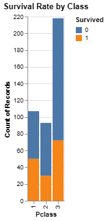
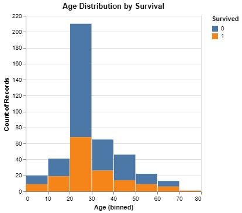
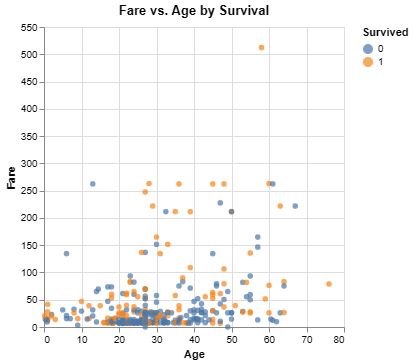
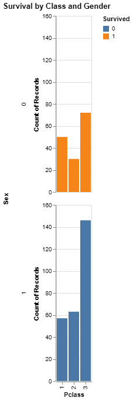
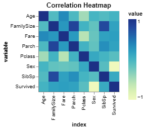

# Titanic Data Analysis Final Report

## 1. Introduction and Goals

### Data Overview
The Titanic dataset provides information on 418 passengers, including features such as passenger class, age, gender, fare, and survival status. The dataset contains missing values in columns like `Age`, `Fare`, and `Cabin`. A thorough understanding of these attributes is crucial for analyzing survival patterns.

### Goals and Objectives
The goal of this project is to explore which factors had the most significant impact on passenger survival rates. Using visualizations, we seek to answer questions such as:
- Did gender and class influence survival rates?
- What was the effect of fare and age on survival?
- Did family size and port of embarkation play a role in determining survival?

To achieve these goals, we created a series of visualizations that help identify relationships and patterns in the data.

## 2. Data Preparation and Feature Engineering

The following steps were taken to preprocess and prepare the data for visualization and analysis:

- **Handling Missing Values**:
    - The `Age` column was filled with the median age to address missing values.
    - The single missing value in `Fare` was replaced with the median fare.
    - Missing values in `Embarked` were filled with the most common embarkation port.

- **Feature Engineering**:
    - **Family Size**: A new feature was created by combining `SibSp` (number of siblings/spouses) and `Parch` (number of parents/children) aboard the ship.
    - **Title**: Titles were extracted from the `Name` column and grouped into common categories.
    - **Deck**: The deck was derived from the `Cabin` column and assigned to a categorical variable.

- **Encoding Categorical Variables**:
    - The `Sex` column was converted to numerical values: female = 0, male = 1.
    - The `Embarked` column was encoded as: C = 0, Q = 1, S = 2.

## 3. Data Visualizations and Analysis

### Visualization 1: Survival Rate by Class
- **Purpose**: This bar chart illustrates the survival rates of passengers based on their class (1st, 2nd, 3rd).
- **Findings**: Passengers in 1st class had the highest survival rates, while those in 3rd class had the lowest. This suggests that socioeconomic status was a significant factor in survival.

### Visualization 2: Age Distribution by Survival
- **Purpose**: To visualize the distribution of ages among survivors and non-survivors.
- **Findings**: Children (especially those aged 0–10) had higher survival rates compared to older passengers. This pattern is consistent with the "women and children first" policy followed during the evacuation.

### Visualization 3: Fare vs. Age Scatter Plot
- **Purpose**: To explore the relationship between fare, age, and survival.
- **Findings**: Passengers who paid higher fares tended to survive more, indicating that fare (which is correlated with class) influenced survival.

### Visualization 4: Survival by Class and Gender
- **Purpose**: This facet grid breaks down survival by class and gender to see combined effects.
- **Findings**: Women in 1st and 2nd class had the highest survival rates, while men in 3rd class had the lowest survival rates.

### Visualization 5: Correlation Heatmap
- **Purpose**: To identify correlations between numerical features.
- **Findings**: Strong correlation was observed between `Fare` and `Pclass`, reflecting that higher-class passengers paid higher ticket prices.

### Visualization 6: Survival by Port of Embarkation
- **Purpose**: To analyze the survival rates based on the port of embarkation.
- **Findings**: Passengers who embarked from port C (Cherbourg) had a higher survival rate compared to those from ports Q (Queenstown) and S (Southampton).

## 4. Key Design Elements and Justification

- **Color Encoding**: Used distinct colors to differentiate between survivors and non-survivors for better visual contrast and quick identification of patterns.
- **Chart Types**: Selected chart types based on the nature of variables:
    - Bar charts for categorical data (e.g., class, port of embarkation).
    - Scatter plots for continuous variables (e.g., age, fare).
- **Faceting**: Used faceting to break down complex relationships, such as survival by class and gender, into simpler charts.
- **Correlation Heatmap**: A heatmap was used to show correlations between different numerical variables, making it easy to spot strong relationships.

These design choices were made to ensure that the visualizations effectively communicate insights while being easy to interpret.

## 5. Evaluation Approach and Feedback

Three individuals (a family member, a colleague, and a friend) were recruited to evaluate the visualizations. Each participant was asked to:

1. Describe what they interpreted from each visualization.
2. Provide feedback on clarity and effectiveness.
3. Suggest improvements or additional visual elements.

**Feedback Summary**:
- The survival rate by class and gender visualization was praised for its clarity and insightfulness.
- The correlation heatmap was found to be less intuitive; it was suggested to add annotations or a legend for better comprehension.
- The scatter plot of fare vs. age was effective, but adding interactive elements like zooming or filtering could enhance exploration.

## 6. Synthesis of Findings and Future Iterations

The visualizations effectively highlighted the influence of gender, class, and fare on survival rates. The project met its goals of identifying key patterns and communicating them through clear visualizations. However, there is room for improvement:

- **Future Iterations**:
    - Include interactive elements, such as filters or tooltips, to make the visualizations more engaging.
    - Refine the correlation heatmap by adding annotations and improving color scales for better readability.

These refinements will enhance the overall impact and accessibility of the visualizations.
